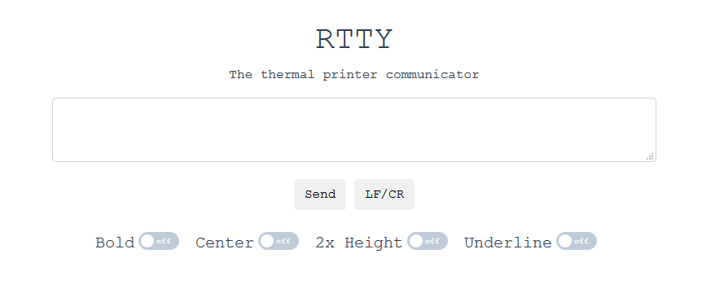

# thermal-tty

Thermal-tty is a web application featuring a Vue based front-end and a Flask based backend to communicate with the [Mini Thermal Receipt printer from Adafruit](https://www.adafruit.com/product/597).

This is a WIP.